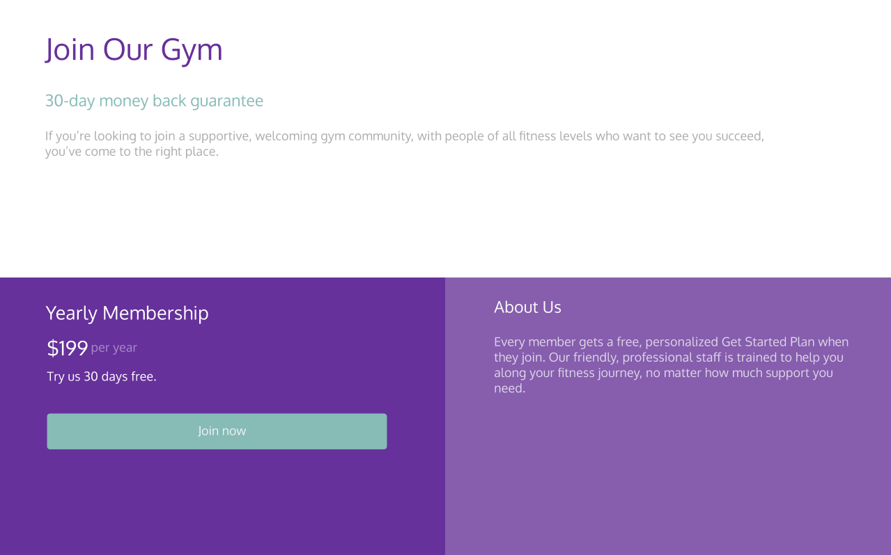

# Frontend Playground - Join Our Gym

## Welcome! 👋

Thanks for checking out this front-end coding challenge.

[Frontend Playground](https://www.frontendplayground.io) challenges allow you to improve your skills in a real-life workflow.

**To do this challenge, you need a basic understanding of HTML and CSS.**

## Where to find everything

Your task is to build out the project to the designs inside the `/design` folder. You will find both a mobile and a desktop version of the design to work to.

The designs are in PNG static format. This will mean that you'll need to use your best judgment for styles such as `font-size`, `padding` and `margin`. This should help train your eye to perceive differences in spacings and sizes.

If you would like the Figma file in order to see sizes etc, it is available to download from the challenge page.

If there are any assents you will find all the required assets in the `/images` folder. The assets are already optimized.

There is also a `style-guide.md` file, which contains the information you'll need, such as color palette and fonts.

Design published at: https://vytautaskaz.github.io/join-our-gym/.  
